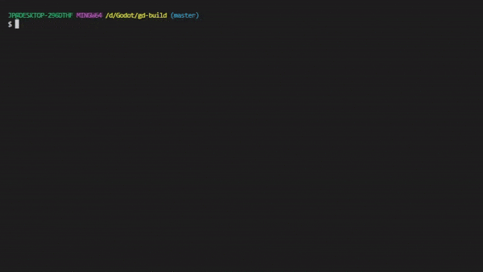

# gd-build

Minimal build tool for Godot



> ⚠️ This version is only compatible with **Godot 3.x**, while Godot 4.x version is still in progress.

## Contents

- [Features](#features)
- [Commands](#commands)
- [Installation](#installation)
- [Getting Started](#getting-started)
- [Best Practices](#best-practices)
  - [Resource Packs](#resource-packs)
  - [Version Control](#version-control)
- [Pre/Post Build Hook](#prepost-build-hook)
- [Known Limitations](#known-limitations)

## Features

- Manage project build state
- Incremental build
- Pre/Post Build Hook

## Commands

```shell
godot --no-window -s build.gd <action> [options...]
```

- Actions
  - `build`: Export game project based on `export_presets.cfg`, it will always try to do incremental build based on modified files and changes in `export_presets.cfg` since last build, add `--full-build=true` option to force full build. On initial build with `gd-build`, it will takes some time to index whole project.
  - `clear-index`: Remove build index to reset build state.
  - `index`: Manually index project files, which is always handled automatically by `build` command.
  - `init`: Create a build script(`build.gd`) at project root.
  - `list-export-presets`: List down all export presets from `export_presets.cfg`, and scan export presets for errors.
  - `list-platforms`: Print platform names `godot` can export to, and list project targeting platforms based on `export_presets.cfg`.
  - `status`: Show current build state like modified files since last build, export presets to rebuild, etc... Run in debug mode `--debug=true` to view relationship between modified files and export presets. Always execute `status` command whenever in doubts.
  - `version`: Print `gd-build` version string.
- Options
  - `--debug={true|false}`: Print debug messages.
  - `--dry-run={true|false}`: Dry run without actually exporting or indexing to preview the process, mainly execute with `build`, `clear-index` and `index`.
  - `--export-debug={true|false}`: Export build with debug mode enabled, `false` by default.
  - `--full-build={true|false}`: Enable to force full build with `build` command. Execute with `index` command to run a full index. `false` by default.
  - `--hash-type={none|md5|sha256}`: Hash type used for indexing and diffing when executing `build` and `status` command, use `none` to compare file by their `modified_time` only, fastest but inaccurate. `md5` is used by default.
  - `--platform={platform_names}`: Select platforms to export to, separate with comma "," without space, for example, `--platform=linux,windows,mac`. Omit to export to all targeting platforms defined in `export_presets.cfg`. Current version of `gd-build` doesn't support indexing by platforms, which means build index will not be updated if not all targeting platforms are selected, see [Know Limitations](#known-limitations).
  - `--silent={true|false}`: Disable logging.
  - `--verbose={true|false}`: Print with datetime and log level, "[time] [level] msg"

## Installation

Install directly from Godot Asset Library

or

Download this repository, move `addons` to your `{project_dir}`

or

Install with [gd-plug](https://github.com/imjp94/gd-plug)

```gdscript
plug("imjp94/gd-build")
```

## Getting Started

Create `build.gd` at project root, with `init` command.

```shell
godot --no-window -s addons/gd-build/build.gd init
```

Execute `build` command to start building right away.

```shell
godot --no-window -s build.gd build
```

> Notice build script changed from `addons/gd-build/build.gd` to `build.gd`

That's it!

For subsequent builds, you can always just execute `build` command, and `gd-build` will only rebuild affected export presets based on modified files and changes in `export_presets.cfg`.

You can also check current build state with `status` command.

```shell
godot --no-window -s build.gd status
```

> Always execute `status` command, whenever in doubts.

## Best Practices

In order to search for modified files since last build, `gd-build` will always need to scan through the whole project. But there's some directories/files that will be ignored:

- Directory name starts with period `.`, for example, `/.git` or `/.gd-build`.
- Directory that consist of `.gdignore`.

So, when working with `gd-build`, it is advised to follow patterns above to ignore directories/files that will never be exported, to optimize the speed of `gd-build` when scanning through the whole project.

For example, build directory `/build` which often used to export game binaries to, can be safely ignored by adding `.gdignore`, since the file changes in `/build` will never affect project build state.

### Resource Packs

The main feature of `gd-build` is incremental build, which allows developer rapidly export project by building only what was changed.

In order to make use of that, project should be configured to export into multiple resource packs, see [Godot Official Documentation - Exporting Packs](https://docs.godotengine.org/en/stable/tutorials/export/exporting_pcks.html).

### Version Control

What can be ignored from version control system?

- `/.gd-build`: Store index and cache by `gd-build`.

What should be added to version control system?

- `build.gd`: Build script

## Pre/Post Build Hook

Overwrite the methods in `build.gd`.

```gdscript
# Build process started
func _on_build_started(contexts):
	pass

# Build process ended
func _on_build_ended(contexts, results):
	pass

# Before execution of a build
func _on_pre_build(context):
	pass

# After execution of a build
func _on_post_build(context, result):
	pass
```

> `context`: `Dictionary` containing `name`, `section`(export preset id in `export_presets.cfg`), `platform`, `runnable`, `export_path`, `export_preset`(`Dictionary` that contain all property defined in `export_presets.cfg`)
>
> `result`: Error code of the build, 0 as successful. See [Godot Official Documentation - Global Scope Error](https://docs.godotengine.org/en/stable/classes/class_@globalscope.html#enum-globalscope-error).
>
> `contexts` and `results` are `Dictionary` keyed by `section`(export preset id in `export_presets.cfg`).

## Known Limitations

- Current version of `gd-build` doesn't support indexing by platforms. So when building with `--platforms` option, `gd-build` may skip indexing if not all targeting platforms are selected. Which means `gd-build` will still ask for a rebuild for the platform selected in `--platforms`.
